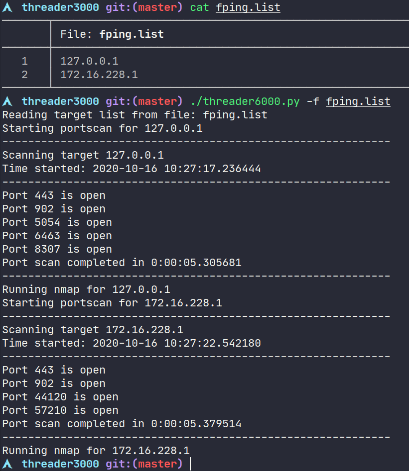

# Threader6000 
### Multi-threaded Python Port Scanner with Nmap integration

Threader6000 is an advanced version of threader3000, a script written in Python3 that allows multi-threaded port scanning. The program takes command line arguments to set the target, thread count etc. Optionally a list of hosts can be specified as well. Giving it a list will iterate through the IP addresses found in the list and do a portscan + nmap service detection on all of them. A full port scan can take as little as 15 seconds, but at max should take less than 1 minute 30 seconds depending on your internet connection. The original author of Threader3000 is [The Mayor](https://github.com/dievus).

## Requirements
Python3 must be installed on your system in order to function
Pip3 for installation via PyPi repository

## Installation
**Installation via Pip (Not yet available - please install via git)**

```bash 
pip3 install threader6000
```

Run by typing:
```bash
./threader6000
```

**Install via Git**
```bash
git clone https://github.com/TuxTheXplorer/threader3000.git
```

You can add Threader6000 to run from any directory by adding a symbolic link:

```bash
sudo ln -s $(pwd)/threader6000.py /usr/local/bin/threader6000
```

## Command line options
```
Usage: threader6000.py <IP> or -f hosts.txt [options]
    -h,    Print this help message
    -q,    Hide banner when running
    -t,    Set thread count
    -u,    Set target IP
    -f,    Iterate through lsit of targets from file
    -i,    Run the original threader3000 program
    -s,    Automatically run nmap on open ports
```

## Examples
- `threader6000.py 127.0.0.1`
- `threader6000.py -u 127.0.0.1 -q`
- `threader6000.py -u 127.0.0.1 -t 500 -q`
- `threader6000.py -t 250 -f host_list.txt`



## FAQ

**Can I use this tool to scan Facebook or other websites I don't have permission to scan?**

*No. That would be illegal.  This tool is under a free license for use, however it is up to the user to observe all applicable laws and appropriate uses for this tool.  The creator does not condone, support, suggest, or otherwise promote unethical or illegal behavior.  You use this tool at your own risk, and under the assumption that you are utilizing it against targets and infrastructure to which you have permission to do so.  Any use otherwise is at your peril and against the terms of use for the tool.*

**Will this tool help me pass the OSCP?**

This tool, when used correctly, helped me pass the OSCP exam. The OSCP is all about time management and enumeration. I give you a tool that is quick and conducts good single target scanning.  It's up to you to use it. _The Mayor_ 
